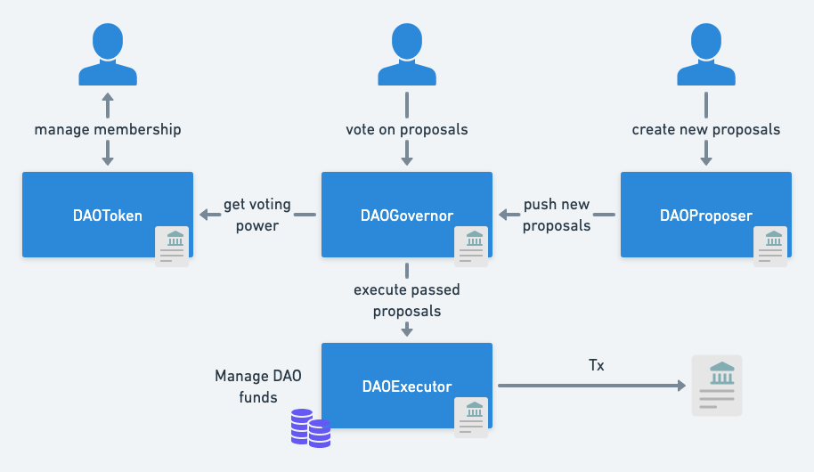

<div align="center">

</div>

# Cantodao

Cantodao is a DAO system built on Canto network initiated during [Canto Online Hackathon | Chapter 1, Season 5](https://github.com/the-COH/chapter_1_season_5)

Cantodao is fully open-source, impregnated with the freedom culture of Canto, and is aimed to become the simplest and easiest-to-use DAO system that leverages Canto features such as CSR for contracts launched by organizations.

## Architecture

- Smart contracts: built using Hardhat framework and tooling
- Front-end: built under `/interface` using React, Chakra UI, and wagmi libraries.

## Smart contracts

The smart contract architecture heavily relies on the governance utilities built by OpenZeppelin. It adds more modifications to allow better UX and simplicity.

The smart contract architecture is composed of the following contracts:

- ### `DAOGovernor`

The core logic of the DAO, the governor orchestrates all the components of the DAO such as voting power determination or proposal creation and execution. This is the main entry point to interact with the DAO.

- ### `DAOProposer`

The proposer contract for a DAO is the contract that has the permission to send a new proposal to a DAO. It must contain the logic that allows one to decide who is eligible to create a new proposal.
`DAOProposer` is a simple proposal contract that is fully permissionless, anyone can create a proposal for a contract.

- ### `DAOToken`

It represents the ERC20 contract for the governance token of the DAO that allows to determine voting power when voting on proposals.
It represents the most basic ERC20 tokens where the deployer of the contract choose the initial supply and the funded address. The contract is ownable and should be owned by the DAO to allow minting new governance tokens.
`DAOGovernor` could accept any contract that implements the `IVote` interface for voting power, we currently only have this contract implemented in this project for the sake of simplicity.

- ### `DAOExecutor`

The executor is the contract that executes approved proposals. Contracts that must be administrated by the DAO should be administrated from this address. This is also the contract that holds the treasury of the DAO.

- ### `DAOFactory`

This is a simple factory contract to deploy a new DAO with all the components. It creates all the contracts listed above and configure the permissions of the contracts to allow to get an operational DAO only with one method call.

<div align="center">

</div>

## Front-end

The front-end interface offers the basic functionalities to create and manage token based DAOs.
The executer smart contract already supports any proposal actions. However, the front-end interface currently only supports the creation of fund transfer proposals. Proposal to transfer DAOs from the DAO to an address.

## Testing

Build and test smart contracts

```
yarn build
yarn test
```

Deploy the smart contracts locally

```
yarn network &
yarn deploy:local
```

Run interface locally

```
yarn dev
```

## Plan

For the sake of the hackathon, as a proof-of-concept, the smart contract architecture has been kept simple and the front-end offers basic functionalities. However, the potential for DAO systems remain still to be developed further and exploring the potential for DAO systems could create a strong synergy with Canto's fully community-owned project structure.

Functionalities include:

- Module to easily manage funds generated by Contract Secured Revenue (CSR) from an organization
- Create community-owned NFTs collections
- Create communities around existing NFTs collections on Canto
